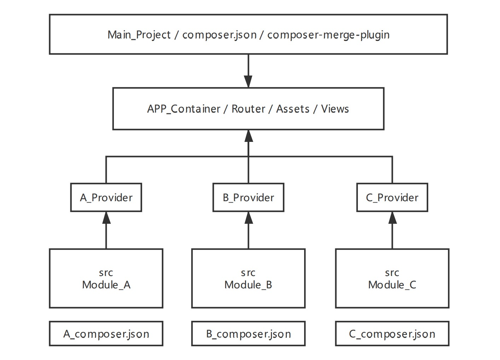

# Laravel-Modules-Demo

Laravel 框架前后端模块化开发动手实践，还在纠结如何使用 `Laravel` 模块化开发项目？



没错，`Composer` 是 `PHP` 扩展包依赖管理工具，`Composer` 四种类或文件加载方式很精妙。
但是测试的时候让人头疼，因为我们不想修改 `vendor` 里面的代码。那么我们可以将 `Composer` 扩展直接作为项目的模块来开发吗？答案是可以的！

我准备了一个含括前后端的模块，他所完成的功能是：模块中定义路由，并使用 `webpack` 构建 `vue` 输出 `hello world`

## 模块目录结构，这里我命名为 `modules`


### 依赖扩展

`composer.json` 文件的合并操作依赖 `composer-merge-plugin` 扩展：
https://github.com/wikimedia/composer-merge-plugin

在当前 `Laravel` 项目中安装它
```shell
$ composer require wikimedia/composer-merge-plugin 
```

### 配置 `include` 指定模块所在路径

下面配置，使用 `*` 通配符指向 `modules` 下所有模块，具体参数介绍：https://github.com/wikimedia/composer-merge-plugin
```markdown
"extra": {
    "merge-plugin": {
      "include": [
        "modules/*/composer.json"
      ],
      "recurse": false,
      "replace": true,
      "ignore-duplicates": true,
      "merge-dev": true,
      "merge-extra": true,
      "merge-extra-deep": false
    }
},
```

### 下载插件代码到 `modules` 目录

如，下载我手动实践的实例 `LaravelModulesDemo` 插件
```shell
$ cd modules
$ git clone https://github.com/Chester-Hee/LaravelModulesDemo.git
```

### 配置 `Provider` or `Alias`

修改 `app.conf` 手工添加 `provider`。
`Laravel 5.5` 支持 `auto discover`，但是 `composer-merge-plugin` 下，无法正常执行，所以暂时使用手工添加配置（是有点low）

```php
"providers" => [
    LaravelModulesDemo\Backend\Providers\TestProvider::class
]
```

```shell
$ cd laravel
$ composer install
```

### `LaravelModulesDemo` 需要进行前端构建

```shell
# 进入模块前端代码
$ cd modules/LaravelModulesDemo/Frontend
# 安装 package 依赖
$ cnpm install
# 构建，可能需要 ./node_modules/.bin/webpack 
$ webpack
```

### 复制静态文件到 `public` 目录下

其实，就是将打包好的 `bundle.js` 拷贝到 `public` 下，如果模块有单独的配置文件，也是在这里进行拷贝
```shell
$ php artisan vendor:publish --provider="LaravelModulesDemo\Backend\Providers\TestProvider"
```
`TestProvider` 具体实现可以按源码，里面定义了一个路由 `test/plugin` 下一步测试访问需要用到。

### 访问路由入口

- https://127.0.0.1/test/plugin

出现 hello world 字样，表示模块已经加载成功！


